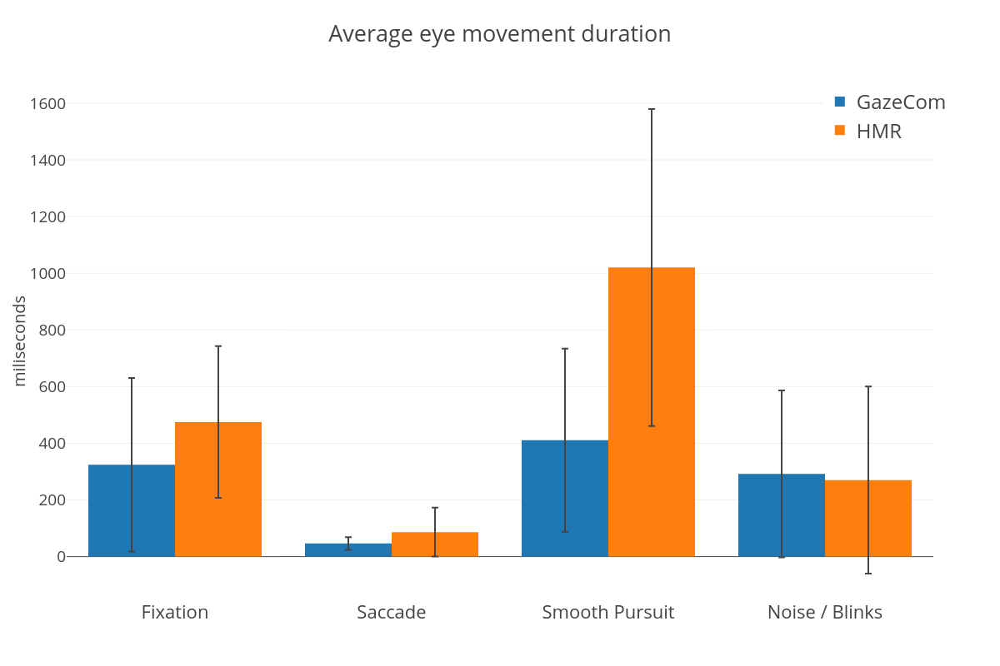
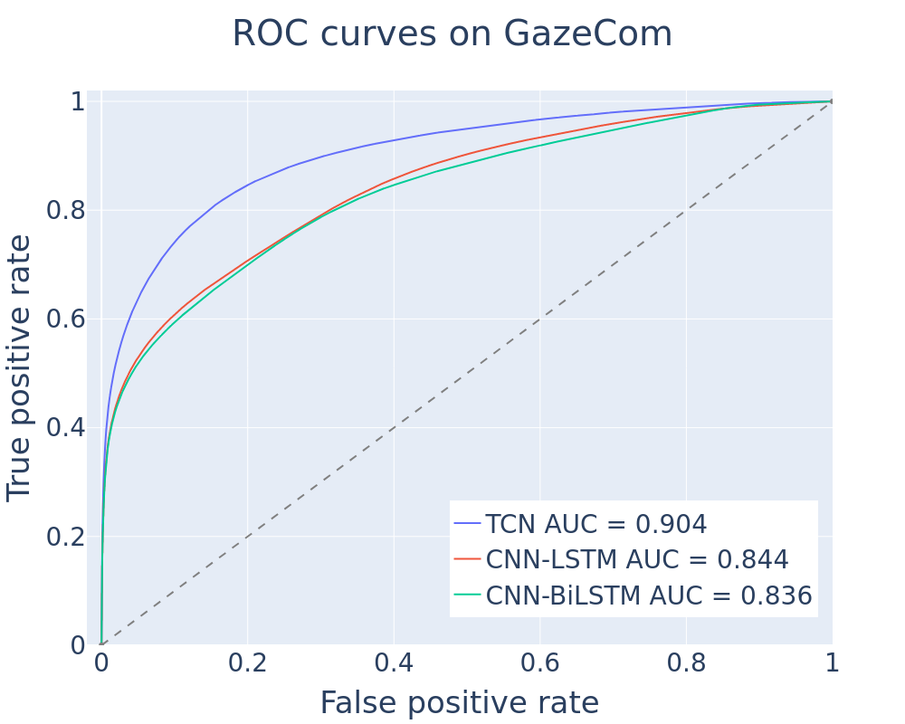
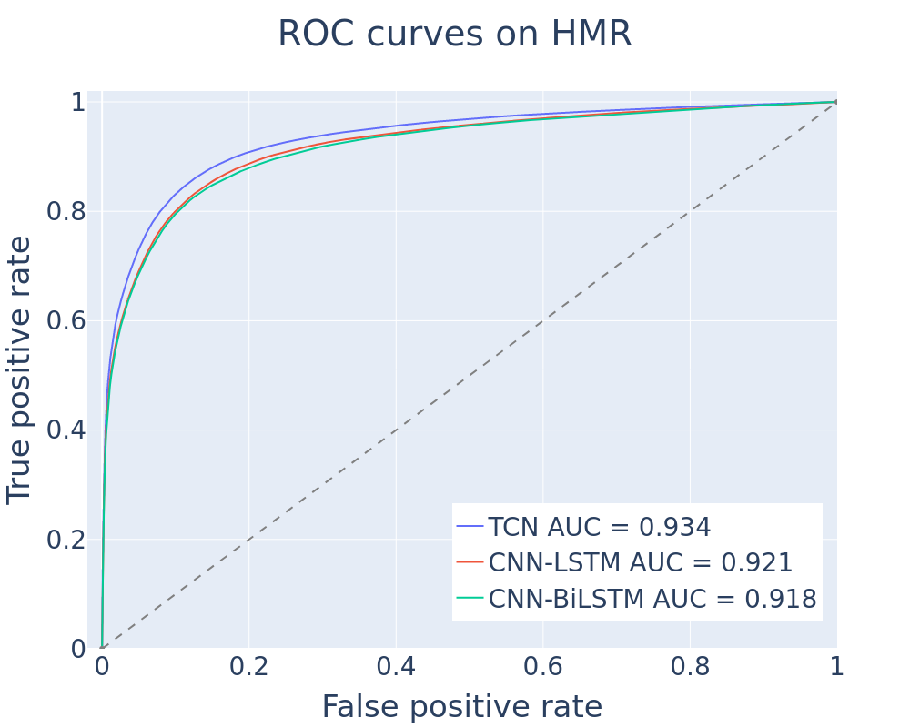

# Online Eye Movement Classification with Temporal Convolutional Networks

This repository is part of a research project on online eye movement classification with 
temporal convolutional networks. It contains the codebase for several deep neural models 
that are able to classify in real time eye movement patterns into fixations, saccades, 
smooth pursuits, and blinks. It also contains the datasets used during this investigation, 
as well as the pre-trained models and their corresponding outputs.


## Training and evaluating

Before running any script, please note that at the current stage only the GazeCom and HMR
datasets are supported. This restriction can be easily disregarded if a
different dataset is provided in a format that can be understood and processed 
by the `preprocessor.py` module. 


#### Requirements

The models contained in this repository were trained using the PyTorch library v1.8+.
Since we cannot guarantee that all scripts will work with newer versions, we 
recommend to stick with v1.8.1 and CUDA 11.6+ to avoid compatibility issues. We also 
recommend that you use a PyTorch docker image instead of running this codebase with 
your native libraries to avoid issues while configuring NVidia libraries.
You can find an appropriate docker image at 
(https://hub.docker.com/r/pytorch/pytorch/tags)[https://hub.docker.com/r/pytorch/pytorch/tags].

Please note that you must have a Docker client up and running on your Linux distro
in order to perform the steps below. If you need help setting up a Docker environment
in your system, you can find more information about it at (https://docs.docker.com/)[https://docs.docker.com/].

Once you have your Docker environment configured and the PyTorch image set up, we recommend you
start the image with the following command:
```
docker run -it --gpus all -v $OEMC_repo:/workspace --device /dev/nvidia0 --device /dev/nvidia-uvm --device /dev/nvidiactl pytorch/pytorch
```

Note that this call assumes that you have only one GPU in your system, that the OEMC repository
path is stored in `$OEMC_repo` variable, and that your PyTorch docker image is `pytorch/pytorch`.

If the container starts running shortly after that, it is now time to install the
Python dependencies. Note that this step is mandatory (regardless if you decided to set up
a Docker environment or not):
```
pip install -r requirements.txt
```


#### Training 

The `main.py` script is the one responsible for preprocessing, training, and evaluating
all neural models. Since no configuration file is loaded when calling the `main.py` script, 
you have to specify some parameters that will define, among other things,
which kind of model should be fitted, what is the dataset, number of epochs, etc.
Here is a complete list of the accepted parameters:

  * `-d/--dataset`: specifies the dataset (only HMR or GazeCom are currently supported)
  * `-m/--model`: which model to train (`tcn`, `cnn_blstm`, or `cnn_lstm`) 
  * `-b/--batch_size`: size of each mini batch (default=2048)
  * `--dropout`: dropout rate in convolutional layers (default=0.25)
  * `-e/--epochs`: number of epochs (default=25)
  * `-k/--kernel_size`: kernel size of convolutional layers (default=5)
  * `-t/--timesteps`: number of time steps used for the time series data
  * `-r/--randomize`: if present, will scramble the samples during training
  * `-f/--folds`: number of folds used for cross-validation (default=5)
  * `-s/--strides`: number of strides to be performed when extracting features (default=8)
  * `-o/--offset`: determines how many steps into the future we allow the model to learn (default=0)
  * `--lr`: learning rate used by the optimization (default=0.01)
  * `--no_lr_decay`: if passed, will prohibit learning rate decay during training
  * `--save_best`: if present, makes the routine save only the best model so far

For example, to train a TCN model against the GazeCom dataset, with batch size of 2048, 
and 25 time steps -- keeping the other default options -- you should do the following:
```
python main.py -d gazecom -m tcn -b 2048 -t 25
```


#### Evaluating

At the end of each epoch, the `main.py` script will use the current fitted model
in the iteration to calculate the F1 scores for each class (i.e., fixation, saccade,
smooth pursuit, and blink/noise) on a separated validation set. Thus, from the total
set separated for training, 90% of it will be used for fitting the model, while the
remaining 10% will be used for validation. 

After running all the stipulated epochs, the script will try to evaluate the
current (or best) model against the test fold, which was not seen in any
way during the training phase. The results will also be shown in terms of F1 scores.

Each model and its corresponding output is saved for every fold of the
cross-validation procedure. At the end of the cross-validation,
the averaged score of all folds is shown on screen. If needed, you can
retrieve these results by manually calling the `scorer.py` script.


#### Online simulation

In order to to evaluate model latency and throughput performance, we created
the `online_sim.py` script. Once you have a trained model, this script loads it
into memory and simulates the model against either the HMR or GazeCom datasets, according
to some command-line parameters.

To perform a simulation, you should employ the exact same parameters passed to
`main.py` when fitting a certain model. This will allow the `online_sim.py`
script to reconstruct appropriately the model, since `main.py` saves only the
`state_dict` object when finished, and not the entire serialized model to disk
(in the case of the pre-trained models, these parameters are specified in the
name of each file).

If you choose, you can also run the online simulator entirely on CPU. In fact,
our benchmarks show that it might be slightly faster to run the pre-trained
models on CPU instead of GPU (probably due to memory transferring latency).

As a final remark, if you want to try out one of the models with real-time
data from an eye tracker, you just have to perform some small modifications in
this script to feed it with your own data. Just remember the pre-trained models
were fitted using a specific context (e.g., eye tracking device, 
sampling rate, calibrated data or not...), so make sure to train an
appropriate model to your context first.


## Datasets

In this work we investigated the online eye movement classification problem with
two datasets: GazeCom and HMR. You can find more information about the GazeCom 
dataset [here](https://scholar.harvard.edu/files/mdorr/files/paper.pdf)[1], but bear 
in mind that we are using a modified version of this dataset that was introduced 
by Startsev et al.[2], and you can find a more detailed description about it 
[here](https://link.springer.com/article/10.3758/s13428-018-1144-2).

The HMR dataset is comprised of uncalibrated eye data from 13 volunteers who wore 
a Pupil Core head-mounted eye tracker [3] while looking at a moving target on 
screen that elicited the following patterns: fixations, saccades, smooth pursuits, 
and blinks. GazeCom presents gaze recordings at 250Hz, while HMR was recorded at 200Hz. 
The distribution of eye movement events of each dataset is shown below:



The GazeCom data is available at the `data_gazecom` folder. Each subdirectory 
represents a video that was shown to a participant and inside of each subfolder 
there is a list of .csv files (each one corresponding to a single participant). 
In the .csv file, you will find the `x` and `y` gaze coordinates on screen, 
the eye tracker confidence value, and the associated label.

The HMR data is available at the `data_hmr` folder. Each subdirectory represents 
the data from a single participant. Inside each subfolder, you will find two .csv files,
each one corresponding to one of the volunteer's eyes. The columns in the .csv files are 
the same ones that are available in the GazeCom dataset, except that in the case of HMR,
`x` and `y` coordinates indicate the tracked pupil position in the eye camera space
instead of on-screen coordinates.

We also include here a script called `dataset_editor.py` that allows you to
visualize and edit both datasets.


## Results, outputs, and pre-trained models

We performed several experiments with the networks (TCN, CNN-BiLSTM, and CNN-LSTM) while 
conducting this study. The results of these trials are available in the `results` folder 
this repository. Inside it, you will find a detailed classification report for each model
and dataset in the files starting with a **clf_report_** prefix. We also provide
the confusion matrices for either sample and event level, as well as the F1 scores
for the additional experiments. In the case of the deep neural models, the general
ROC-AUC curves are the following:



For the sake of reproducibility, we also provide the outputs and pre-trained neural models
for all the described experiments in our paper. You can find the full outputs in the
`final_outputs` folder, while the models are available in the `final_models` folder.

To load an already trained model from one of the experiments, you can use the `online_sim.py`
script, as explained before.


### Acknowledgements

This work was funded by the São Paulo Research Foundation, grants 2015/26802-1 and 2016/10148-3. 


### References

* [1] Agtzidis, I., Startsev, M., & Dorr, M. (2016a). In the pursuit of (ground) truth: A hand-labelling tool for eye movements recorded during dynamic scene viewing. In 2016 IEEE second workshop on eye tracking and visualization (ETVIS) (pp. 65–68).
* [2] Startsev, M., Agtzidis, I. and Dorr, M., 2019. 1D CNN with BLSTM for automated classification of fixations, saccades, and smooth pursuits. Behavior Research Methods, 51(2), pp.556-572.
* [3] https://pupil-labs.com/products/core/

### Cite this work

```
@article{elmadjian:2022,
  title={Online eye-movement classification with temporal convolutional networks},
  author={Elmadjian, Carlos and Gonzales, Candy and Costa, Rodrigo Lima da and Morimoto, Carlos H},
  journal={Behavior Research Methods},
  pages={1--19},
  year={2022},
  publisher={Springer}
}
```
